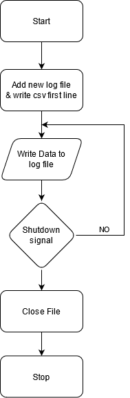

# Whitepaper

## Program Flow
Here's a flow chart of how the program runs.

## Output values
Value|Unit
---|---
UTC|unix millies
T+|secs
Temp|°K
Hum| g/kg or g/m³
Press|hPa
Height above NN |m
IMU rot. data (multiple individual values)|depends
CO2|ppm
Feinstaub|TODO
